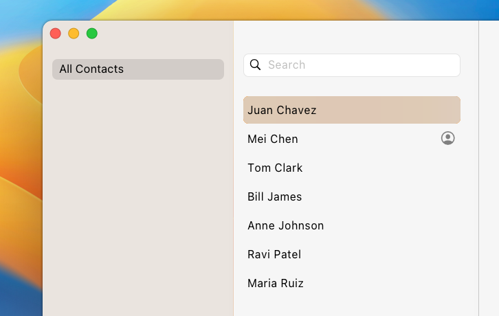

# Materials in Web Applications

Authors: [Diego Gonzalez](https://github.com/diekus), [Andy Luhrs](https://github.com/aluhrs13)

## Status of this Document

This document is a starting point for engaging the community and standards bodies in developing collaborative solutions fit for standardization. As the solutions to problems described in this document progress along the standards-track, we will retain this document as an archive and use this section to keep the community up-to-date with the most current standards venue and content location of future work and discussions.

- This document status: **Brainstorming**
- Expected venue: TBD
- **Current version: this document**

## Introduction
Using translucent textures for backgrounds is a growing pattern for applications on modern operating systems. Web applications can come close to mimicing some of these behaviors with CSS when overlapping their own context, but translucency to applications or content behind the app isn't possible today.

Developers should be able to make their web applications look and feel like they're built for the device they're running on, and materials is a gap today.

## Goals

- Allow web developers to follow some/many of the most common practices for using textures on operating systems that support them.
- Design a solution that will scale to future design systems.

## Non-goals

- Handle 100% of material-related use-cases.
- Build an API surface that exactly matches what native applications can do.

## Proposed Solution - PWA Background Material
The two most prevalent patterns for materials today are in [Apple operating systems](https://developer.apple.com/design/human-interface-guidelines/materials) and [Windows 11](https://learn.microsoft.com/en-us/windows/apps/design/style/mica). Both of these operating systems align in their primary use-case of materials is background transparency, with macOS recommending materials for sidebars:



and Windows recommending applications use it for side navigation and title bars:


We propose adding a property to a PWA manifest that allows an app to declare a prioritized list of materials that it would like to use as its background if possible, conceptually similar to `font-family` matching the the phrasing the OS uses for the material, something like:

```json
    background_materials = ["windows-mica", "macos-ultrathick", "ios-regular", "windows-acrylic", "#87ceeb"]
```

The browser would attempt to use the given materials if possible, with the (optional) final color being a fallback. We may need an additional media query feature to allow the site to conditionally make the content on top of it transparent:

```css
    @media (background-material: "windows-mica"){
        body{
            background-color: rgba(0, 0, 0, 0);
        }
    }
```

## Alternatives Considered
### CSS Colors
There is a secondary use of materials for elements layered on top of each other, but translucency between elements on the same page is already possible with transparency and other CSS features. There might be an opportunity to make them easier to use in the future.

## Concerns/Open Questions
1. 

## Glossary

## Acknowledgements
